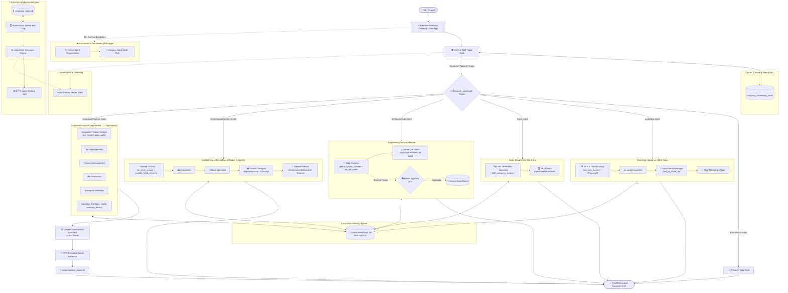

# 🏗️ MAK Enterprise OS — Architecture & Layman System Workflow

Welcome to the technical and architectural overview of **MAK Enterprise OS**. This document explains how your autonomous multi-agent operating system works in plain, simple terms, complete with a visual flowchart of the system architecture.

---

## 💡 System Overview (In Plain English)

Imagine **MAK Enterprise OS** as an autonomous digital enterprise corporate headquarters. When you submit a request (e.g., *"Draft a B2B cold email sequence"*, *"Write Python FastAPI microservice"*, or *"Create an omnichannel video script and thumbnail prompt"*), the system does not rely on a single generic AI prompt. Instead, it delegates your request through a structured hierarchy of 20+ specialized AI experts across dedicated business units:

1. **Chief of Staff (Triage Gatekeeper)**: Inspects internal company SOPs, thinks step-by-step (Chain-of-Thought reasoning), and routes intent to the exact specialized department.
2. **Specialized Department Mini-Crews**: Autonomous teams of agents execute multi-agent pipelines:
   - **Content House**: 5-agent omnichannel production studio with RSS trend scraping and YouTube hook reverse-engineering.
   - **Software House (Engineering)**: AST Python syntax validation and Human-in-the-Loop (HITL) terminal file execution.
   - **B2B Sales Engine**: DuckDuckGo + BeautifulSoup company website scraper and strict `SalesEmail` guardrails.
   - **Marketing Studio**: Google SERP scraper, Playwright headless browser, and social publishing API.
   - **Corporate Finance & Risk**: 12+ financial analysts with real-time `yfinance` market data and DCF modeling.
   - **Education**: Finance tutor for step-by-step concept breakdowns.
3. **Live Web Scrapers & Market Tools**: Real-time access to Google search, DuckDuckGo, Yahoo Finance, RSS feeds, and YouTube transcripts.
4. **Central Knowledge Base (RAG)**: Retrieval-Augmented Generation scanning internal files (`company_knowledge_base/`).
5. **Continuous Local Memory**: Persistent entity and semantic memory powered by HuggingFace `all-MiniLM-L6-v2`.
6. **Autonomy Engine**: Background worker that evaluates scheduled cron jobs every 60 seconds and synthesizes spoken audio briefings (`gTTS`).
7. **Autonomous Self-Healing Rescue Mission**: Emergency Doctor & Surgeon crew that catches runtime crashes, diagnoses stack traces, and applies source code patches.

---

## 📊 Complete System Architecture Flowchart



---

## 🏛️ Deep-Dive into Department Ecosystems

### 1. 🎬 Content House Omnichannel Studio (`content_house_department.py`)
- **Creative Director**: Ingests industry RSS feeds via `rss_trend_scraper` and extracts opening retention hooks from benchmark videos via `youtube_hook_analyzer`.
- **Scriptwriter**: Converts the brief into long-form video scripts and written articles/threads for LinkedIn, Twitter/X, and blogs.
- **Hook Specialist**: Formulates high-retention viral hooks and curiosity gaps for the opening 3 seconds of video and first lines of text.
- **Graphic Designer**: Crafts hyper-detailed Midjourney/DALL-E 3 image generation prompts for banners and thumbnails.
- **Video Producer**: Assembles video dialogue, B-roll cinematography instructions, text-on-screen directives, and outputs the structured `OmnichannelDeliverable` Pydantic object.

### 2. 💻 Engineering Software House (`engineering_department.py`)
- **Code Surgeon**: Writes clean, modular Python source code. Enforces two-tier safety:
  1. *Autonomous AST Verification*: Compiles code via `python_syntax_checker` (`ast.parse`) before saving.
  2. *Human-in-the-Loop (HITL)*: Invokes `hitl_file_writer`, pausing for terminal approval (`Approve these code changes? (y/n)`).
- **Senior QA Tester**: Audits proposed code for boundary conditions, race conditions, and LangGraph pipeline compatibility.

### 3. 📈 B2B Sales Engine (`sales_department.py`)
- **Lead Generation Specialist**: Queries target companies via `b2b_company_scraper` (DuckDuckGo + BeautifulSoup), scraping homepage messaging and extracting pain points.
- **VP of Sales**: Transforms lead intelligence into consultative cold outreach conforming strictly to the `SalesEmail` Pydantic schema (with automated validation blocking spam words like *"100% free"* or *"guarantee"*).

### 4. 📣 Marketing Studio (`marketing_department.py`)
- **SEO & Trend Analyst**: Scrapes real-time Google SERPs via `live_seo_scraper` (`googlesearch-python`) and browses dynamic JavaScript pages via Playwright (`dynamic_browser_tool`).
- **Lead Copywriter**: Translates SEO data into persuasive landing page messaging.
- **Social Media Manager**: Formats platform-specific posts and publishes them via `post_to_social_api`.
- **CMO**: Provides final executive review against corporate Brand Guidelines.

### 5. 🏦 Corporate Finance & Risk (`finance_department.py`)
- **12+ Specialists**: CFO, Corporate Finance Analyst, Risk, Treasury, Capital Structure, M&A, Controller, Portfolio, Valuation, Credit, Inventory, FP&A.
- **Live Market Data**: Queries Yahoo Finance (`yfinance`) for live equity quotes, 52-week ranges, P/E ratios, EBITDA, and revenue multiples.
- **Context Compression**: Token summarizer compresses intermediate financial output to $\le 300$ words before final CFO board synthesis.

---

## 🔒 Enterprise Safety & Guardrails

```text
User Request ──► Triage Gatekeeper (Chain-of-Thought)
                      │
                      ├──► Pydantic Output Validation (Schema Enforcement)
                      ├──► AST Compilation Pre-Check (Zero Syntax Errors)
                      ├──► Terminal HITL Pause (User Explicit Authorization)
                      └──► Fallback LLM Router (Exponential Backoff on 429)
```

1. **Structured Output Typing**: Every department uses validated Pydantic schemas (`SalesEmail`, `OmnichannelDeliverable`, `RoutingDecision`).
2. **Deterministic Fallbacks**: Primary inference on `groq/llama-3.1-8b-instant`, automatically failing over to `groq/llama-3.3-70b-versatile` or OpenRouter with backoff retry logic.
3. **Persistent Local Data**: SQLite storage for tasks (`scheduled_tasks.db`), local HuggingFace MiniLM vector weights, and mounted Docker volumes prevent data loss on restarts.
